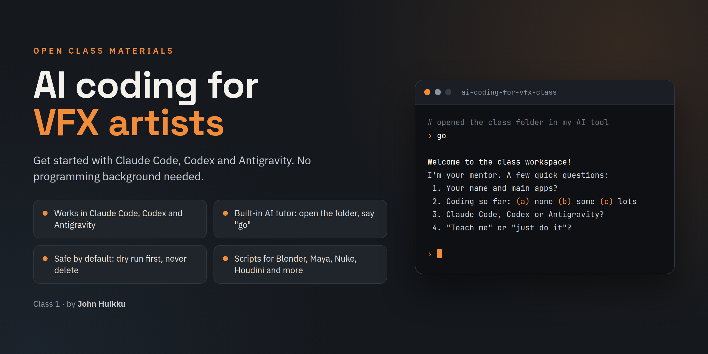

  

# AI Coding for VFX Artists

*Class materials by John Huikku.*

Get started with **Claude Code, Codex or Antigravity** as a VFX artist: organize
and convert files, write scripts for your DCC, and build small tools. No
programming background needed.

**This folder is your class workspace.** Open it in your AI assistant and it
becomes your personal tutor, with the studio safety rules and skills already
loaded.

## Start in 3 steps

1. **Get the folder onto your own drive.** Clone it, or use the green
   **Code → Download ZIP** button and unzip it. Keep it somewhere local like
   `Documents`, not inside Google Drive, OneDrive or Dropbox.
2. **Install one AI tool** (whichever your subscription includes: Claude Code,
   Codex or Antigravity) and open this folder in it. See *03 Setup Guide.pdf*.
   (Using the Antigravity CLI? Its command is `agy`. If your terminal says it's
   not found right after installing, close and reopen the terminal.)
3. **Say "go".** (Or *"Hi, I just opened this folder after the class. What
   now?"*) It becomes your tutor: asks a few questions, makes practice files
   and suggests your first project.

## What's in here

| File | What it's for |
|---|---|
| `00 START HERE.pdf` | One page: first steps and the five safety habits |
| `02 Companion Guide.pdf` | Everything from the class, plus prompts, glossary and FAQ |
| `03 Setup Guide.pdf` | Installing your tool, ffmpeg, Python and GitHub (Windows, Mac, Linux) |
| `04 Safety & Your Data.pdf` | What goes to the cloud and what never does, on one page |
| `05 Stack Guide.pdf` | What to use when you build tools and apps |
| `prompts/` | Setup prompts and the prompt library, copy-paste clean |
| `starter-pack/` | Studio rules and skills to copy into **your own** project folders |
| `mentor-prompt.txt` | The tutor, for chat apps (ChatGPT, Claude, Gemini) |
| `AGENTS.md`, `.claude/`, `.agents/` | What your assistant reads: tutor mode, rules, skills. Don't delete them. |

## Getting updates

If you cloned it, ask your assistant: *"Pull the latest class updates."*
(That's `git pull`.) Your learning log and practice files are never touched.
If you downloaded a ZIP, download it again and ask your assistant to copy your
`LEARNING_LOG.md`, `practice/` and `scripts/` across.

## Stuck?

Ask your AI first, every time. Then the docs. Then John.
